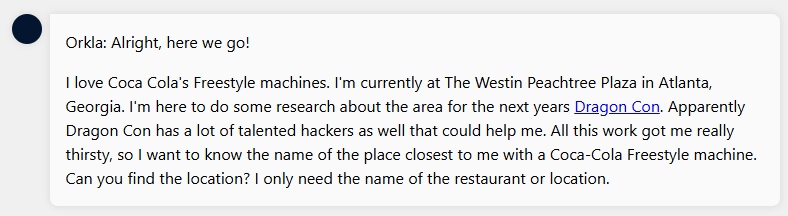
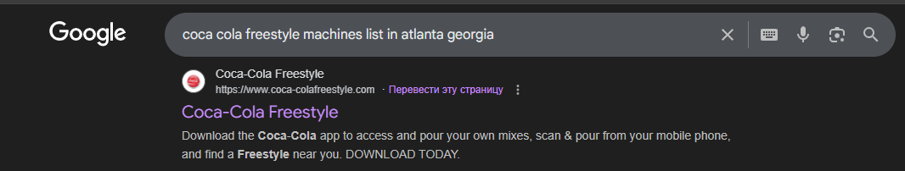
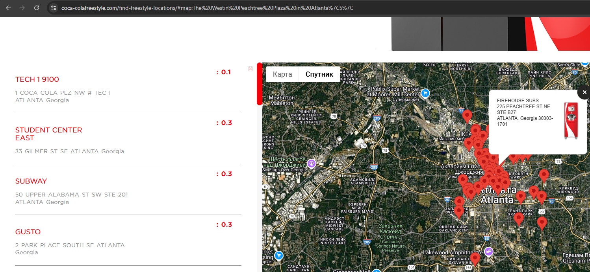
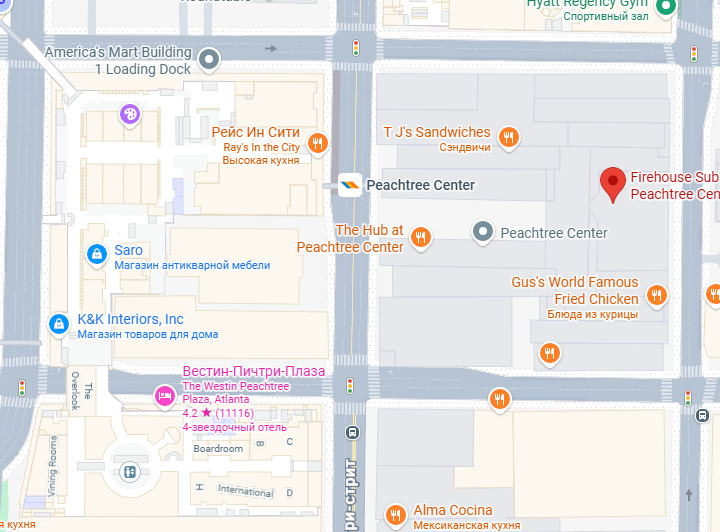
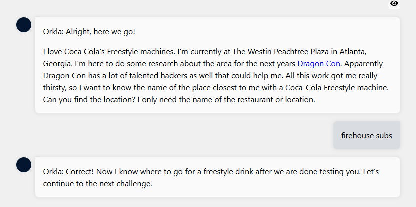

## 🐉 Orkla — Dragon Con Detective & KACE Scenario Specialist

Orkla is a sharp-minded, quick-footed investigator who built a reputation working the strangest corners of Dragon Con—where missing props, rogue cosplayers, and unexplained tech glitches often hide real-world threats. Blending old-school detective instincts with modern security know-how, Orkla is the one people call when a “small problem” turns out to be anything but.

Off the convention floor, Orkla is known for designing KACE-based investigation scenarios that teach teams how to hunt anomalies, track digital footprints, and respond to incidents under pressure. His scenarios mix creativity with realism, turning routine IT tasks into engaging detective missions.

A mix of humor, grit, and methodical thinking, Orkla thrives where chaos meets curiosity—whether it's decoding a suspicious badge scan, following breadcrumbs through a ticketing system, or solving a mystery no one else even noticed.

# First task 
we should find the nearest location of Coca-Cola Freestyle machine to The Westin Peachtree Plaza in Atlanta, Georgia. Below the screenshot with full description:

1) On maps we will search for *The Westin Peachtree Plaza in Atlanta, Georgia*

2) Next we will search for *Coca Cola's Freestyle machines in Atlanta, Georgia* and we will find the web-site which is related with Coca-cola's freestyle machines

there will be search bar and will search closest machine to The Westin Peachtree Plaza in Atlanta, Georgia

when we will search for nearest to the location we are looking, we will see that *Firehouse Subs* is the closest one than others

